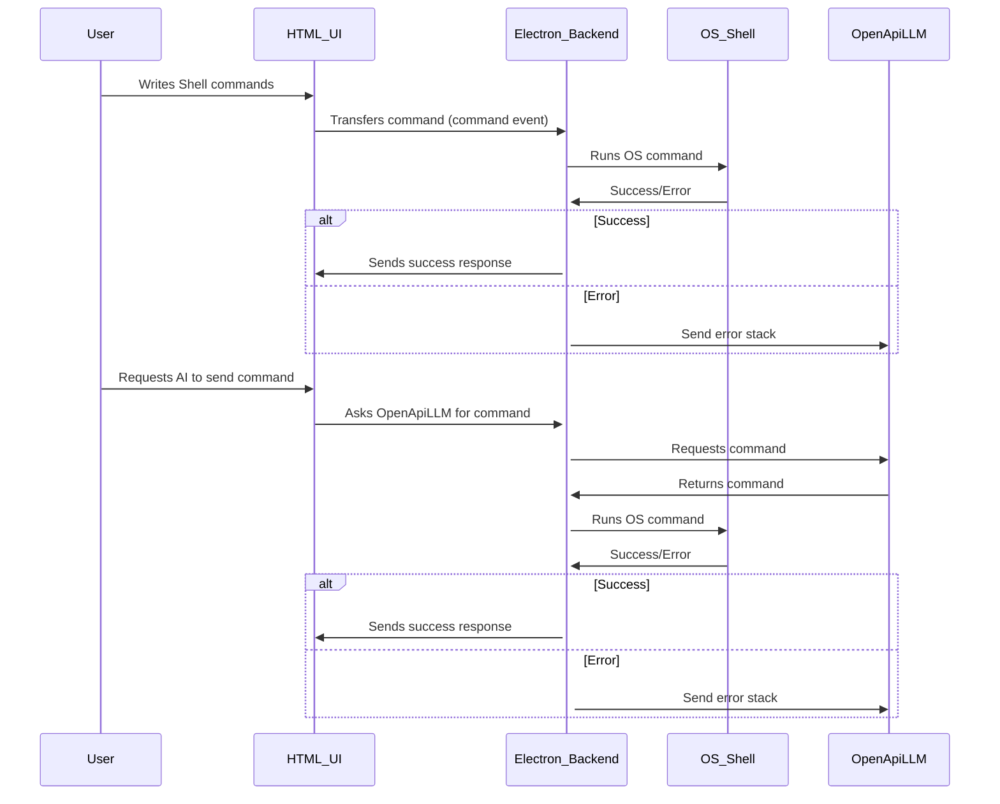

<div align="center">
<a href="https://refine.dev/">
    
</a>
</div>

<br/>
<div>
<div align="center">


![LangChain](https://img.shields.io/badge/-langchain-purple?style-plastic-green&logo=data:image/svg+xml;base64,PHN2ZyB3aWR0aD0iMzIwIiBoZWlnaHQ9IjE2MCIgdmlld0JveD0iMCAwIDMyMCAxNjAiIGZpbGw9Im5vbmUiIHhtbG5zPSJodHRwOi8vd3d3LnczLm9yZy8yMDAwL3N2ZyI+CjxwYXRoIGQ9Ik01MC4wMTI0IDExOS4zNTFDNTAuMDEyNCAxMTkuMzUxIDUzLjA2MjQgMTMxLjkwMSA1Mi41ODc0IDEzMy42NjNDNTIuMTEyNCAxMzUuNDI2IDQzLjQzNzQgMTM2LjgyNiAzOC4zODc0IDEzOS40MTNDMzUuMDc0OSAxNDEuMTEzIDI5LjczNzQgMTQ0LjkwMSAzMi45ODc0IDE0Ny45NjNDMzQuNzQ5OSAxNDkuNjI2IDM5LjY3NDkgMTQ1LjQyNiA1NC40NjI0IDE0NC41NzZDNjkuNDc0OSAxNDMuNzEzIDcyLjEyNDkgMTQ0LjkzOCA3MS4zNDk5IDE0MS43NjNDNzAuNTg3NCAxMzguNjAxIDY2LjU5OTkgMTM4LjIzOCA2My4yNDk5IDEzNi44MzhDNjIuMTM3NCAxMzYuMzc2IDYwLjg0OTkgMTM1LjYzOCA2MC4zMTI0IDEzNC44MzhDNTkuNzk5OSAxMzQuMDc2IDYwLjU0OTkgMTIxLjExMyA2MC41NDk5IDEyMS4xMTNMNTAuMDEyNCAxMTkuMzUxWiIgZmlsbD0iI0ZFQkEwMiIvPgo8cGF0aCBkPSJNNzcuNyAxMjguMTQ5Qzc3LjcgMTI4LjE0OSA3OC4wNSAxNDAuODM3IDc4LjA1IDE0MS42NDlDNzguMDUgMTQyLjgzNyA3NS4xNSAxNDQuMjYyIDcwLjgzNzUgMTQ1LjIyNEM2Ni41MjUgMTQ2LjE4NyA1Ny45ODc1IDE0Ny43ODcgNTcuODc1IDE1My4yNDlDNTcuOCAxNTYuNjEyIDc0LjI3NSAxNTIuMDYyIDgzLjY4NzUgMTUyLjE5OUM5My4xIDE1Mi4zMzcgOTkuMTM3NSAxNTMuNTc0IDk4LjcgMTQ5LjYyNEM5OC4zNSAxNDYuNDYyIDkzLjQ1IDE0NS4wMjQgOTAuODEyNSAxNDQuNDQ5Qzg4LjE3NSAxNDMuODc0IDg2Ljk3NSAxNDIuNTg3IDg2LjkgMTQxLjAxMkM4Ni44NSAxMzkuOTg3IDg3LjA3NSAxMjguNDI0IDg3LjA3NSAxMjguNDI0TDc3LjcgMTI4LjE0OVoiIGZpbGw9IiNGRUJBMDIiLz4KPHBhdGggZD0iTTUyLjM2MjYgMTAuMDEzTDYzLjY4NzYgOS4yNTA0OUM2My42ODc2IDkuMjUwNDkgNjkuOTg3NiAxMS4yODggNzUuOTc1MSAxOS45NjNDODMuOTI1MSAzMS41MDA1IDgyLjg3NTEgNTIuNjAwNSA4Mi44NzUxIDUyLjYwMDVMMTA0LjcgMTEwLjc4OEwxMDcuMzM4IDEzMC4wMjVDMTA3LjMzOCAxMzAuMDI1IDg3LjgxMjYgMTMzLjEgNjguNjg3NiAxMzAuNjEzQzQ2LjE2MjYgMTI3LjY3NSAyMi45Mzc2IDEwNy4yNjMgMjMuMjg3NiA3Ni43NjNDMjMuNjM3NiA0Ni4yNjMgNDcuODEyNiAxNi44MTMgNDcuODEyNiAxNi44MTNMNTIuMzYyNiAxMC4wMTNaIiBmaWxsPSJ1cmwoI3BhaW50MF9saW5lYXJfMV84OSkiLz4KPHBhdGggZD0iTTI2LjQzNzggMjEuMTYzMUMyNi40Mzc4IDIxLjE2MzEgMTcuNzUwMyAyMy44NjMxIDE1LjI4NzggMzMuNjAwNkMxMi44MjUzIDQzLjMzODEgMTYuOTM3OCA1Mi40MDA2IDE4Ljc1MDMgNTMuMDEzMUMxOS40NTAzIDUzLjI1MDYgMjEuNjI1MyA0OC44NTA2IDIxLjYyNTMgNDguODUwNkMyMS42MjUzIDQ4Ljg1MDYgMjQuNjc1MyA1Mi4zNzU2IDI2LjIwMDMgNTMuMTg4MUMyNy43MjUzIDU0LjAxMzEgMjguNDg3OCA1NC42MjU2IDI5LjgzNzggNTQuNTM4MUMzMi40NzUzIDU0LjM2MzEgMzYuMzUwMyA0Ni42NzU2IDM2LjIzNzggNDEuNTEzMUwzNy41ODc4IDE2LjIyNTZMMjYuNDM3OCAyMS4xNjMxWiIgZmlsbD0iI0ZGRDUxRCIvPgo8cGF0aCBkPSJNMzcuMzEyMyAzNS4xMTMxQzM3LjMxMjMgMzUuMTEzMSA0Ny44OTk4IDMzLjM1MDYgNTIuMTI0OCAyOS43MTMxQzU2LjM0OTggMjYuMDc1NiA2MS4yNzQ4IDIyLjc4ODEgNjIuOTEyMyAxNi4yMjU2QzYzLjkxMjMgMTIuMjI1NiA2My45NjIzIDkuNDI1NiA2My45NjIzIDkuNDI1NkM2My45NjIzIDkuNDI1NiA0OS4xOTk4IDAuODYzMDk2IDM1LjgyNDggNy45MDA2QzIyLjQ0OTggMTQuOTM4MSAyNS42MTIzIDI0LjUwMDYgMjUuNjEyMyAyNC41MDA2TDM3LjMxMjMgMzUuMTEzMVoiIGZpbGw9IiNGRjJCMjMiLz4KPHBhdGggZD0iTTM2Ljg3NDcgMzYuNTI1OUMzNi44NzQ3IDM2LjUyNTkgMjguMzEyMiA0MS41NzU5IDI3LjM3NDcgNDIuMjc1OUMyNi40MzcyIDQyLjk3NTkgMjMuMzc0NyA0NC41MDA5IDIxLjk3NDcgNDUuNjc1OUMxOS43NDk3IDQ3LjU1MDkgMTcuNzQ5NyA1MS43NzU5IDE4LjU3NDcgNTIuODM4NEMxOS4zOTk3IDUzLjg4ODQgMjAuNTc0NyA1MC42MTM0IDIzLjg0OTcgNDguNjEzNEMyNy4xMjQ3IDQ2LjYxMzQgMzIuNzYyMiA0My40NTA5IDM0LjI4NzIgNDIuNjI1OUMzNS44MTIyIDQxLjgwMDkgMzYuMjg3MiA0MS4zMzg0IDM2LjI4NzIgNDEuMzM4NEwzNi44NzQ3IDM2LjUyNTlaIiBmaWxsPSIjRkY2MDBEIi8+CjxwYXRoIGQ9Ik0zOS43ODc1IDM0LjMyNUM0MC4zNzUgMzMuMDg3NSA0MC42Mzc1IDMwLjI1IDM2LjY1IDI1LjI2MjVDMzEuOTYyNSAxOS40IDI1LjM4NzUgMTkuMTYyNSAyNS4zODc1IDE5LjE2MjVMMjQuNjg3NSAyMS41MTI1TDMxLjk2MjUgMjguNzg3NUwzNiAzNy41QzM2IDM3LjUgMzguNTc1IDM2Ljg3NSAzOS43ODc1IDM0LjMyNVoiIGZpbGw9IiNBMDJBMUIiLz4KPHBhdGggZD0iTTE5Ljg2MjcgMjUuNTAwNEMxOS44NjI3IDI1LjUwMDQgMjUuMjYyNyAyNS44NTA0IDI5LjAxMjcgMjkuMTM3OUMzMS4yMzc3IDMxLjA4NzkgMzQuNjAwMiAzNS4yNjI5IDM1LjQyNTIgMzcuMTUwNEMzNi4yNTAyIDM5LjAzNzkgMzkuMDYyNyAzMy44MTI5IDM2LjgzNzcgMzAuMjg3OUMzNC42MTI3IDI2Ljc2MjkgMzEuOTUwMiAyMy4yMjU0IDI3LjAyNTIgMjEuNTEyOUMyMy40NzUyIDIwLjI4NzkgMjAuMTAwMiAyMy4yNzU0IDE5Ljg2MjcgMjUuNTAwNFoiIGZpbGw9IiNFQzgwQUYiLz4KPHBhdGggZD0iTTYxLjg2MjUgMzIuNDI1QzYxLjg2MjUgMzIuNDI1IDU3LjUyNSAyMS40IDQ4LjYgMjEuODYyNUMzOS42IDIyLjMzNzUgMzguMjEyNSAyOS4wMjUgMzguNjI1IDMzLjAxMjVDMzkuMSAzNy42MjUgNDIuMTUgNDAuMTc1IDQ5LjE4NzUgMzkuOTM3NUM1Ni4yMzc1IDM5LjY4NzUgNjEuODYyNSAzMi40MjUgNjEuODYyNSAzMi40MjVaIiBmaWxsPSIjRkJEM0IzIi8+CjxwYXRoIGQ9Ik01NS4yOTk5IDMxLjAxMTNDNTUuMjk5OSAzMy44NjEzIDUyLjE5OTkgMzYuNDExMyA0OS4zNzQ5IDM2LjQxMTNDNDYuNTYyNCAzNi40MTEzIDQ0LjI3NDkgMzQuMDk4OCA0NC4yNzQ5IDMxLjI0ODhDNDQuMjc0OSAyOC4zOTg4IDQ1LjkxMjQgMjUuMjYxMyA0OS44OTk5IDI1LjAzNjNDNTQuMTEyNCAyNC43NzM4IDU1LjI5OTkgMjguMTYxMyA1NS4yOTk5IDMxLjAxMTNaIiBmaWxsPSIjMzEyRjJBIi8+CjxwYXRoIGQ9Ik0xMDcuOTc1IDEwMC45MzhDMTA3Ljk3NSAxMDAuOTM4IDExMC43ODcgMTA3LjI3NSAxMjEuNTg3IDExNC4zMTJDMTMwLjc1IDEyMC4yODcgMTM1LjIgMTIzLjkzOCAxNDEuNTM4IDEyNi4xNjNDMTQ3Ljg3NSAxMjguMzg4IDE0OC4xMTMgMTI4Ljk3NSAxNDcuODc1IDEzMC4xNUMxNDcuNjM4IDEzMS4zMjUgMTM3Ljc4NyAxMzguOTUgMTI2Ljk4NyAxMzguMDEzQzExNi4yIDEzNy4wNzUgMTExLjAzNyAxMzIuODUgMTA3Ljc1IDEzMC42MjVDMTA0LjQ2MiAxMjguNCA5OC4yNSAxMTIuNjc1IDk4LjI1IDExMi42NzVMMTA3Ljk3NSAxMDAuOTM4WiIgZmlsbD0iIzAxQUI0NiIvPgo8cGF0aCBkPSJNODIuOTI1IDUyLjNDODIuOTI1IDUyLjMgNjcuOTYyNSA1Ni43IDYxLjQgNjYuNjc1QzU1LjkgNzUuMDI1IDU2LjM4NzUgODkuMjI1IDYxLjk4NzUgOTkuNzYyNUM2OC45MTI1IDExMi43ODcgODMuMjI1IDEyMi4wNSA5MC44NSAxMjUuNTc1Qzk4LjQ3NSAxMjkuMSAxMDguOTEyIDEzMC44NSAxMTMuNDg3IDEzMC4zODdDMTE4LjA2MiAxMjkuOTI1IDEwOS4zODcgOTguMzYyNSAxMDEuMDUgODEuNDYyNUM5Mi45MjUgNjQuOTc1IDgyLjkyNSA1Mi4zIDgyLjkyNSA1Mi4zWiIgZmlsbD0iI0I3RDAxOSIvPgo8cGF0aCBkPSJNMTg5Ljg4OCAxMzAuMDI1QzE4MS43NjMgMTIxLjczNyAxODEuNzYzIDEwOC41MTIgMTg5Ljg4OCAxMDAuMjI1TDIxMy4zMTMgNzYuNzk5OEMyMTUuODYzIDc0LjI0OTggMjE5LjIxMyA3Mi4zMzczIDIyMi43MTMgNzEuMzg3M0MyMjYuMjEzIDcwLjQzNzMgMjI5Ljg4OCA3MC40MzczIDIzMy4yMjYgNzEuMjI0OEMyMzYuNzI2IDcyLjE3NDggMjQwLjA3NiA3My45MzczIDI0Mi43ODggNzYuNDg3M0MyNDIuOTUxIDc2LjY0OTggMjQyLjk1MSA3Ni42NDk4IDI0My4xMDEgNzYuNzk5OEMyNTEuMzg4IDg1LjA4NzMgMjUxLjM4OCA5OC4zMTIzIDI0My4xMDEgMTA2LjZMMjE5LjY3NiAxMzAuMDI1QzIxMS40MDEgMTM4LjMxMiAxOTguMDEzIDEzOC4zMTIgMTg5Ljg4OCAxMzAuMDI1Wk0yNTYuMTc2IDYzLjczNzNDMjQwLjcyNiA0OC4yODczIDIxNS4zODggNDguMjg3MyAxOTkuOTI2IDYzLjczNzNMMTc2LjY2MyA4Ny4xNjIzQzE2MS4yMTMgMTAyLjYxMiAxNjEuMjEzIDEyNy45NSAxNzYuNjYzIDE0My40MTJDMTkyLjExMyAxNTguODc1IDIxNy40NTEgMTU4Ljg2MiAyMzIuOTEzIDE0My40MTJMMjU2LjMzOCAxMTkuOTg3QzI3MS42MjYgMTA0LjUyNSAyNzEuNjI2IDc5LjE5OTggMjU2LjE3NiA2My43MzczWiIgZmlsbD0iIzg0QjBDMSIvPgo8cGF0aCBkPSJNMjQzLjU3NSA2MC41OTk4QzI0Ny43NzUgNTguNDg3MyAyNTEuNzg4IDU5Ljk2MjMgMjUxLjc4OCA1OS45NjIzQzI0My4xMTMgNTMuNTQ5OCAyMzMuNjUgNTEuNzI0OCAyMjUuNSA1Mi4yMzczQzIyNS40NSA1Mi4yOTk4IDIyNS40MTMgNTIuMzYyMyAyMjUuMzYzIDUyLjQzNzNDMjIxLjc4OCA1Ny45MjQ4IDIyMC45ODggNjUuMTc0OCAyMjMuMjEzIDcxLjI3NDhDMjI2LjU2MyA3MC40NDk4IDIzMC4wMzggNzAuNDc0OCAyMzMuMjEzIDcxLjIzNzNDMjM0LjUxMyA3MS41ODczIDIzNS41IDcxLjkyNDggMjM3LjQ1IDcyLjgzNzNDMjM3LjQ2MyA3Mi44MjQ4IDIzNi43NzUgNjQuMDI0OCAyNDMuNTc1IDYwLjU5OThaIiBmaWxsPSIjMkY3ODg5Ii8+CjxwYXRoIGQ9Ik0yMTguNDUyIDczLjA3NDlDMjE4LjYxNCA3MS44NjI0IDIxOC42ODkgNzAuNjM3NCAyMTguNzY0IDY5LjQxMjRDMjE5LjExNCA2NC4xMzc0IDIyMC4wMTQgNTguODg3NCAyMjEuNDM5IDUzLjc5OTlDMjIxLjUzOSA1My40Mzc0IDIyMS42MzkgNTMuMDQ5OSAyMjEuNzM5IDUyLjY2MjRDMjE3Ljg3NyA1My4yNzQ5IDIxNC4wODkgNTQuNDQ5OSAyMTAuNTI3IDU2LjE5OTlDMjA0Ljk3NyA2My4zNjI0IDIwNi44MDIgNzIuNjM3NCAyMTMuMzE0IDc2LjgxMjRDMjE0LjgwMiA3NS4zMjQ5IDIxNi41NTIgNzQuMDYyNCAyMTguNDUyIDczLjA3NDlaIiBmaWxsPSIjMkY3ODg5Ii8+CjxwYXRoIGQ9Ik0yOTAuMTEzIDI5Ljk3NDhDMjk4LjIzOCAzOC4yNjIzIDI5OC4yMzggNTEuNDg3MyAyOTAuMTEzIDU5Ljc3NDhMMjY2LjY4OCA4My4xOTk4QzI2NC4xMzggODUuNzQ5OCAyNjAuNzg4IDg3LjY2MjMgMjU3LjI4OCA4OC42MTIzQzI1My43ODggODkuNTYyMyAyNTAuMTEzIDg5LjU2MjMgMjQ2Ljc3NiA4OC43NzQ4QzI0My4yNzYgODcuODI0OCAyMzkuOTI2IDg2LjA2MjMgMjM3LjIxMyA4My41MTIzQzIzNy4wNTEgODMuMzQ5OCAyMzcuMDUxIDgzLjM0OTggMjM2LjkwMSA4My4xOTk4QzIyOC42MTMgNzQuOTEyMyAyMjguNjEzIDYxLjY4NzMgMjM2LjkwMSA1My4zOTk4TDI2MC4zMjYgMjkuOTc0OEMyNjguNjAxIDIxLjY4NzMgMjgxLjk4OCAyMS42ODczIDI5MC4xMTMgMjkuOTc0OFpNMjIzLjgyNiA5Ni4yNjIzQzIzOS4yNzYgMTExLjcxMiAyNjQuNjEzIDExMS43MTIgMjgwLjA3NiA5Ni4yNjIzTDMwMy4zMzggNzIuODM3M0MzMTguNzg4IDU3LjM4NzMgMzE4Ljc4OCAzMi4wNDk4IDMwMy4zMzggMTYuNTg3M0MyODcuODg4IDEuMTI0ODEgMjYyLjU1MSAxLjEzNzMxIDI0Ny4wODggMTYuNTg3M0wyMjMuNjc2IDQwLjAxMjNDMjA4LjM3NiA1NS40NzQ4IDIwOC4zNzYgODAuNzk5OCAyMjMuODI2IDk2LjI2MjNaIiBmaWxsPSIjODRCMEMxIi8+CjxwYXRoIGQ9Ik0yMjMuMDYyIDQ5LjI3NDdDMjIzLjExMiA0OS4yMzcyIDIyMy4xNjIgNDkuMTg3MiAyMjMuMjEyIDQ5LjE0OTdDMjIzLjg3NCA0OC41NzQ3IDIyNC42MTIgNDguMDI0NyAyMjUuNDc0IDQ3Ljg3NDdDMjI2LjMzNyA0Ny43MjQ3IDIyNy4zNDkgNDguMTEyMiAyMjcuNjQ5IDQ4LjkzNzJDMjI3Ljg3NCA0OS41NDk3IDIyNy42NzQgNTAuMjI0NyAyMjcuNDYyIDUwLjgzNzJDMjI0LjE3NCA2MC43NzQ3IDIyMS41MzcgNzMuMzg3MiAyMjQuNzM3IDgzLjY3NDdDMjI1LjA0OSA4NC42NzQ3IDIyNS4zNDkgODUuOTYyMiAyMjQuNTEyIDg2LjU4NzJDMjI0LjAyNCA4Ni45NjIyIDIyMy4yOTkgODYuODk5NyAyMjIuNzYyIDg2LjYxMjJDMjE2Ljg4NyA4My40MzcyIDIxNS44NjIgNzQuODM3MiAyMTUuNTg3IDY4LjkzNzJDMjE1LjI2MiA2MS40ODcyIDIxNy4zMjQgNTQuMzEyMiAyMjMuMDYyIDQ5LjI3NDdaIiBmaWxsPSIjQThFM0YwIi8+CjxwYXRoIGQ9Ik0yNDkuMTUyIDg5LjE3NDlDMjQ4LjM1MiA4OS4wNzQ5IDI0Ny41MDIgODguOTEyNCAyNDcuNTAyIDg4LjkxMjRDMjQ3LjUwMiA4OC45MTI0IDI0Ny4zNzcgOTQuMjQ5OSAyNDMuMTE0IDk4LjY3NDlDMjM4LjM4OSAxMDMuNTc1IDIzMy42NzcgMTAzLjQ1IDIzMy42NzcgMTAzLjQ1QzIzNi4xNjQgMTA0Ljg4NyAyNDEuMTI3IDEwNi4zNzUgMjQyLjkyNyAxMDYuOEwyNDMuMTE0IDEwNi42MTJDMjQ3LjkwMiAxMDEuODEyIDI0OS45MDIgOTUuMzYyNCAyNDkuMTUyIDg5LjE3NDlaIiBmaWxsPSIjMkY3ODg5Ii8+CjxwYXRoIGQ9Ik0yNzMuNDUgNzYuNDM2OEwyNjYuNzg3IDgzLjA5OTNDMjY4LjQ1IDkwLjUyNDMgMjY4IDk4LjMyNDMgMjY1LjQyNSAxMDUuNTI0QzI2OC42NjIgMTA0LjM3NCAyNzEuNzc1IDEwMi43ODcgMjc0LjY3NSAxMDAuNzc0QzI3OS40NjIgOTIuNTc0MyAyNzguNDEyIDgyLjg4NjggMjczLjQ1IDc2LjQzNjhaIiBmaWxsPSIjMkY3ODg5Ii8+CjxwYXRoIGQ9Ik0yNTkuODYzIDg3LjUxMjNDMjU5LjA3NiA4NS41MjQ4IDI1Ny41MzggODMuNTEyMyAyNTUuNjEzIDgzLjY5OThDMjU0LjQxMyA4My44MTIzIDI1Mi41NTEgODQuOTM3MyAyNTIuNjc2IDg4LjM3NDhDMjUyLjc2MyA5MS4wMzczIDI1My43NzYgOTMuNjM3MyAyNTIuMzI2IDk3LjEyNDhDMjUwLjIwMSAxMDIuMjI1IDI1MC42ODggMTAzLjYgMjUxLjIwMSAxMDQuNDEyQzI1MS43NjMgMTA1LjMgMjUyLjgwMSAxMDUuNyAyNTMuNzYzIDEwNS42ODdDMjU2LjMwMSAxMDUuNjc1IDI1OC40MDEgMTAzLjM1IDI1OS41NTEgMTAwLjhDMjYxLjQxMyA5Ni43MjQ4IDI2MS41MjYgOTEuNjg3MyAyNTkuODYzIDg3LjUxMjNaIiBmaWxsPSIjQThFM0YwIi8+CjxwYXRoIGQ9Ik0yMjEuNTYzIDEzNS4yMjVDMjIyLjM2MyAxMzQuNTYzIDIyNC40MzggMTMyLjM1IDIyNS40IDEzMy43NUMyMjUuMDUgMTM3LjYgMjIyLjA4OCAxNDAuNzM4IDIxOC44MzggMTQyLjgzOEMyMTQuODM4IDE0NS40MjUgMjEwLjEgMTQ2Ljk1IDIwNS4zMzggMTQ2LjgxM0MyMDEuMzg4IDE0Ni43IDE5NC44MzggMTQ1LjEgMTkyLjUzOCAxNDEuNDM4QzE5MC42NjMgMTM4LjQ2MyAxOTQuNjI1IDEzNy45NSAxOTYuODI1IDEzOC43NzVDMjA0LjY2MyAxNDEuNzYzIDIxMy41MjUgMTQxLjgyNSAyMjEuNTYzIDEzNS4yMjVaIiBmaWxsPSIjQThFM0YwIi8+CjxkZWZzPgo8bGluZWFyR3JhZGllbnQgaWQ9InBhaW50MF9saW5lYXJfMV84OSIgeDE9IjU4LjU2NzEiIHkxPSIxMjEuMzIyIiB4Mj0iODIuMzIxNyIgeTI9IjQyLjA2MTQiIGdyYWRpZW50VW5pdHM9InVzZXJTcGFjZU9uVXNlIj4KPHN0b3Agb2Zmc2V0PSIwLjEzNjIiIHN0b3AtY29sb3I9IiM3OURBODgiLz4KPHN0b3Agb2Zmc2V0PSIwLjMwMzkiIHN0b3AtY29sb3I9IiM1N0NENzUiLz4KPHN0b3Agb2Zmc2V0PSIwLjYzNDMiIHN0b3AtY29sb3I9IiMxOUI1NTMiLz4KPHN0b3Agb2Zmc2V0PSIwLjc5MTQiIHN0b3AtY29sb3I9IiMwMUFCNDYiLz4KPC9saW5lYXJHcmFkaWVudD4KPC9kZWZzPgo8L3N2Zz4K)
![LangChain](https://img.shields.io/badge/-langchain-purple?style-plastic-green&logo=data:image/svg+xml;base64,PHN2ZyB3aWR0aD0iMTYiIGhlaWdodD0iMTYiIHZpZXdCb3g9IjAgMCAzMjAgMTYwIiBmaWxsPSJub25lIiB4bWxucz0iaHR0cDovL3d3dy53My5vcmcvMjAwMC9zdmciPgo8cGF0aCBkPSJNNTAuMDEyNCAxMTkuMzUxQzUwLjAxMjQgMTE5LjM1MSA1My4wNjI0IDEzMS45MDEgNTIuNTg3NCAxMzMuNjYzQzUyLjExMjQgMTM1LjQyNiA0My40Mzc0IDEzNi44MjYgMzguMzg3NCAxMzkuNDEzQzM1LjA3NDkgMTQxLjExMyAyOS43Mzc0IDE0NC45MDEgMzIuOTg3NCAxNDcuOTYzQzM0Ljc0OTkgMTQ5LjYyNiAzOS42NzQ5IDE0NS40MjYgNTQuNDYyNCAxNDQuNTc2QzY5LjQ3NDkgMTQzLjcxMyA3Mi4xMjQ5IDE0NC45MzggNzEuMzQ5OSAxNDEuNzYzQzcwLjU4NzQgMTM4LjYwMSA2Ni41OTk5IDEzOC4yMzggNjMuMjQ5OSAxMzYuODM4QzYyLjEzNzQgMTM2LjM3NiA2MC44NDk5IDEzNS42MzggNjAuMzEyNCAxMzQuODM4QzU5Ljc5OTkgMTM0LjA3NiA2MC41NDk5IDEyMS4xMTMgNjAuNTQ5OSAxMjEuMTEzTDUwLjAxMjQgMTE5LjM1MVoiIGZpbGw9IiNGRUJBMDIiLz4KPHBhdGggZD0iTTc3LjcgMTI4LjE0OUM3Ny43IDEyOC4xNDkgNzguMDUgMTQwLjgzNyA3OC4wNSAxNDEuNjQ5Qzc4LjA1IDE0Mi44MzcgNzUuMTUgMTQ0LjI2MiA3MC44Mzc1IDE0NS4yMjRDNjYuNTI1IDE0Ni4xODcgNTcuOTg3NSAxNDcuNzg3IDU3Ljg3NSAxNTMuMjQ5QzU3LjggMTU2LjYxMiA3NC4yNzUgMTUyLjA2MiA4My42ODc1IDE1Mi4xOTlDOTMuMSAxNTIuMzM3IDk5LjEzNzUgMTUzLjU3NCA5OC43IDE0OS42MjRDOTguMzUgMTQ2LjQ2MiA5My40NSAxNDUuMDI0IDkwLjgxMjUgMTQ0LjQ0OUM4OC4xNzUgMTQzLjg3NCA4Ni45NzUgMTQyLjU4NyA4Ni45IDE0MS4wMTJDODYuODUgMTM5Ljk4NyA4Ny4wNzUgMTI4LjQyNCA4Ny4wNzUgMTI4LjQyNEw3Ny43IDEyOC4xNDlaIiBmaWxsPSIjRkVCQTAyIi8+CjxwYXRoIGQ9Ik01Mi4zNjI2IDEwLjAxM0w2My42ODc2IDkuMjUwNDlDNjMuNjg3NiA5LjI1MDQ5IDY5Ljk4NzYgMTEuMjg4IDc1Ljk3NTEgMTkuOTYzQzgzLjkyNTEgMzEuNTAwNSA4Mi44NzUxIDUyLjYwMDUgODIuODc1MSA1Mi42MDA1TDEwNC43IDExMC43ODhMMTA3LjMzOCAxMzAuMDI1QzEwNy4zMzggMTMwLjAyNSA4Ny44MTI2IDEzMy4xIDY4LjY4NzYgMTMwLjYxM0M0Ni4xNjI2IDEyNy42NzUgMjIuOTM3NiAxMDcuMjYzIDIzLjI4NzYgNzYuNzYzQzIzLjYzNzYgNDYuMjYzIDQ3LjgxMjYgMTYuODEzIDQ3LjgxMjYgMTYuODEzTDUyLjM2MjYgMTAuMDEzWiIgZmlsbD0idXJsKCNwYWludDBfbGluZWFyXzFfODkpIi8+CjxwYXRoIGQ9Ik0yNi40Mzc4IDIxLjE2MzFDMjYuNDM3OCAyMS4xNjMxIDE3Ljc1MDMgMjMuODYzMSAxNS4yODc4IDMzLjYwMDZDMTIuODI1MyA0My4zMzgxIDE2LjkzNzggNTIuNDAwNiAxOC43NTAzIDUzLjAxMzFDMTkuNDUwMyA1My4yNTA2IDIxLjYyNTMgNDguODUwNiAyMS42MjUzIDQ4Ljg1MDZDMjEuNjI1MyA0OC44NTA2IDI0LjY3NTMgNTIuMzc1NiAyNi4yMDAzIDUzLjE4ODFDMjcuNzI1MyA1NC4wMTMxIDI4LjQ4NzggNTQuNjI1NiAyOS44Mzc4IDU0LjUzODFDMzIuNDc1MyA1NC4zNjMxIDM2LjM1MDMgNDYuNjc1NiAzNi4yMzc4IDQxLjUxMzFMMzcuNTg3OCAxNi4yMjU2TDI2LjQzNzggMjEuMTYzMVoiIGZpbGw9IiNGRkQ1MUQiLz4KPHBhdGggZD0iTTM3LjMxMjMgMzUuMTEzMUMzNy4zMTIzIDM1LjExMzEgNDcuODk5OCAzMy4zNTA2IDUyLjEyNDggMjkuNzEzMUM1Ni4zNDk4IDI2LjA3NTYgNjEuMjc0OCAyMi43ODgxIDYyLjkxMjMgMTYuMjI1NkM2My45MTIzIDEyLjIyNTYgNjMuOTYyMyA5LjQyNTYgNjMuOTYyMyA5LjQyNTZDNjMuOTYyMyA5LjQyNTYgNDkuMTk5OCAwLjg2MzA5NiAzNS44MjQ4IDcuOTAwNkMyMi40NDk4IDE0LjkzODEgMjUuNjEyMyAyNC41MDA2IDI1LjYxMjMgMjQuNTAwNkwzNy4zMTIzIDM1LjExMzFaIiBmaWxsPSIjRkYyQjIzIi8+CjxwYXRoIGQ9Ik0zNi44NzQ3IDM2LjUyNTlDMzYuODc0NyAzNi41MjU5IDI4LjMxMjIgNDEuNTc1OSAyNy4zNzQ3IDQyLjI3NTlDMjYuNDM3MiA0Mi45NzU5IDIzLjM3NDcgNDQuNTAwOSAyMS45NzQ3IDQ1LjY3NTlDMTkuNzQ5NyA0Ny41NTA5IDE3Ljc0OTcgNTEuNzc1OSAxOC41NzQ3IDUyLjgzODRDMTkuMzk5NyA1My44ODg0IDIwLjU3NDcgNTAuNjEzNCAyMy44NDk3IDQ4LjYxMzRDMjcuMTI0NyA0Ni42MTM0IDMyLjc2MjIgNDMuNDUwOSAzNC4yODcyIDQyLjYyNTlDMzUuODEyMiA0MS44MDA5IDM2LjI4NzIgNDEuMzM4NCAzNi4yODcyIDQxLjMzODRMMzYuODc0NyAzNi41MjU5WiIgZmlsbD0iI0ZGNjAwRCIvPgo8cGF0aCBkPSJNMzkuNzg3NSAzNC4zMjVDNDAuMzc1IDMzLjA4NzUgNDAuNjM3NSAzMC4yNSAzNi42NSAyNS4yNjI1QzMxLjk2MjUgMTkuNCAyNS4zODc1IDE5LjE2MjUgMjUuMzg3NSAxOS4xNjI1TDI0LjY4NzUgMjEuNTEyNUwzMS45NjI1IDI4Ljc4NzVMMzYgMzcuNUMzNiAzNy41IDM4LjU3NSAzNi44NzUgMzkuNzg3NSAzNC4zMjVaIiBmaWxsPSIjQTAyQTFCIi8+CjxwYXRoIGQ9Ik0xOS44NjI3IDI1LjUwMDRDMTkuODYyNyAyNS41MDA0IDI1LjI2MjcgMjUuODUwNCAyOS4wMTI3IDI5LjEzNzlDMzEuMjM3NyAzMS4wODc5IDM0LjYwMDIgMzUuMjYyOSAzNS40MjUyIDM3LjE1MDRDMzYuMjUwMiAzOS4wMzc5IDM5LjA2MjcgMzMuODEyOSAzNi44Mzc3IDMwLjI4NzlDMzQuNjEyNyAyNi43NjI5IDMxLjk1MDIgMjMuMjI1NCAyNy4wMjUyIDIxLjUxMjlDMjMuNDc1MiAyMC4yODc5IDIwLjEwMDIgMjMuMjc1NCAxOS44NjI3IDI1LjUwMDRaIiBmaWxsPSIjRUM4MEFGIi8+CjxwYXRoIGQ9Ik02MS44NjI1IDMyLjQyNUM2MS44NjI1IDMyLjQyNSA1Ny41MjUgMjEuNCA0OC42IDIxLjg2MjVDMzkuNiAyMi4zMzc1IDM4LjIxMjUgMjkuMDI1IDM4LjYyNSAzMy4wMTI1QzM5LjEgMzcuNjI1IDQyLjE1IDQwLjE3NSA0OS4xODc1IDM5LjkzNzVDNTYuMjM3NSAzOS42ODc1IDYxLjg2MjUgMzIuNDI1IDYxLjg2MjUgMzIuNDI1WiIgZmlsbD0iI0ZCRDNCMyIvPgo8cGF0aCBkPSJNNTUuMjk5OSAzMS4wMTEzQzU1LjI5OTkgMzMuODYxMyA1Mi4xOTk5IDM2LjQxMTMgNDkuMzc0OSAzNi40MTEzQzQ2LjU2MjQgMzYuNDExMyA0NC4yNzQ5IDM0LjA5ODggNDQuMjc0OSAzMS4yNDg4QzQ0LjI3NDkgMjguMzk4OCA0NS45MTI0IDI1LjI2MTMgNDkuODk5OSAyNS4wMzYzQzU0LjExMjQgMjQuNzczOCA1NS4yOTk5IDI4LjE2MTMgNTUuMjk5OSAzMS4wMTEzWiIgZmlsbD0iIzMxMkYyQSIvPgo8cGF0aCBkPSJNMTA3Ljk3NSAxMDAuOTM4QzEwNy45NzUgMTAwLjkzOCAxMTAuNzg3IDEwNy4yNzUgMTIxLjU4NyAxMTQuMzEyQzEzMC43NSAxMjAuMjg3IDEzNS4yIDEyMy45MzggMTQxLjUzOCAxMjYuMTYzQzE0Ny44NzUgMTI4LjM4OCAxNDguMTEzIDEyOC45NzUgMTQ3Ljg3NSAxMzAuMTVDMTQ3LjYzOCAxMzEuMzI1IDEzNy43ODcgMTM4Ljk1IDEyNi45ODcgMTM4LjAxM0MxMTYuMiAxMzcuMDc1IDExMS4wMzcgMTMyLjg1IDEwNy43NSAxMzAuNjI1QzEwNC40NjIgMTI4LjQgOTguMjUgMTEyLjY3NSA5OC4yNSAxMTIuNjc1TDEwNy45NzUgMTAwLjkzOFoiIGZpbGw9IiMwMUFCNDYiLz4KPHBhdGggZD0iTTgyLjkyNSA1Mi4zQzgyLjkyNSA1Mi4zIDY3Ljk2MjUgNTYuNyA2MS40IDY2LjY3NUM1NS45IDc1LjAyNSA1Ni4zODc1IDg5LjIyNSA2MS45ODc1IDk5Ljc2MjVDNjguOTEyNSAxMTIuNzg3IDgzLjIyNSAxMjIuMDUgOTAuODUgMTI1LjU3NUM5OC40NzUgMTI5LjEgMTA4LjkxMiAxMzAuODUgMTEzLjQ4NyAxMzAuMzg3QzExOC4wNjIgMTI5LjkyNSAxMDkuMzg3IDk4LjM2MjUgMTAxLjA1IDgxLjQ2MjVDOTIuOTI1IDY0Ljk3NSA4Mi45MjUgNTIuMyA4Mi45MjUgNTIuM1oiIGZpbGw9IiNCN0QwMTkiLz4KPHBhdGggZD0iTTE4OS44ODggMTMwLjAyNUMxODEuNzYzIDEyMS43MzcgMTgxLjc2MyAxMDguNTEyIDE4OS44ODggMTAwLjIyNUwyMTMuMzEzIDc2Ljc5OThDMjE1Ljg2MyA3NC4yNDk4IDIxOS4yMTMgNzIuMzM3MyAyMjIuNzEzIDcxLjM4NzNDMjI2LjIxMyA3MC40MzczIDIyOS44ODggNzAuNDM3MyAyMzMuMjI2IDcxLjIyNDhDMjM2LjcyNiA3Mi4xNzQ4IDI0MC4wNzYgNzMuOTM3MyAyNDIuNzg4IDc2LjQ4NzNDMjQyLjk1MSA3Ni42NDk4IDI0Mi45NTEgNzYuNjQ5OCAyNDMuMTAxIDc2Ljc5OThDMjUxLjM4OCA4NS4wODczIDI1MS4zODggOTguMzEyMyAyNDMuMTAxIDEwNi42TDIxOS42NzYgMTMwLjAyNUMyMTEuNDAxIDEzOC4zMTIgMTk4LjAxMyAxMzguMzEyIDE4OS44ODggMTMwLjAyNVpNMjU2LjE3NiA2My43MzczQzI0MC43MjYgNDguMjg3MyAyMTUuMzg4IDQ4LjI4NzMgMTk5LjkyNiA2My43MzczTDE3Ni42NjMgODcuMTYyM0MxNjEuMjEzIDEwMi42MTIgMTYxLjIxMyAxMjcuOTUgMTc2LjY2MyAxNDMuNDEyQzE5Mi4xMTMgMTU4Ljg3NSAyMTcuNDUxIDE1OC44NjIgMjMyLjkxMyAxNDMuNDEyTDI1Ni4zMzggMTE5Ljk4N0MyNzEuNjI2IDEwNC41MjUgMjcxLjYyNiA3OS4xOTk4IDI1Ni4xNzYgNjMuNzM3M1oiIGZpbGw9IiM4NEIwQzEiLz4KPHBhdGggZD0iTTI0My41NzUgNjAuNTk5OEMyNDcuNzc1IDU4LjQ4NzMgMjUxLjc4OCA1OS45NjIzIDI1MS43ODggNTkuOTYyM0MyNDMuMTEzIDUzLjU0OTggMjMzLjY1IDUxLjcyNDggMjI1LjUgNTIuMjM3M0MyMjUuNDUgNTIuMjk5OCAyMjUuNDEzIDUyLjM2MjMgMjI1LjM2MyA1Mi40MzczQzIyMS43ODggNTcuOTI0OCAyMjAuOTg4IDY1LjE3NDggMjIzLjIxMyA3MS4yNzQ4QzIyNi41NjMgNzAuNDQ5OCAyMzAuMDM4IDcwLjQ3NDggMjMzLjIxMyA3MS4yMzczQzIzNC41MTMgNzEuNTg3MyAyMzUuNSA3MS45MjQ4IDIzNy40NSA3Mi44MzczQzIzNy40NjMgNzIuODI0OCAyMzYuNzc1IDY0LjAyNDggMjQzLjU3NSA2MC41OTk4WiIgZmlsbD0iIzJGNzg4OSIvPgo8cGF0aCBkPSJNMjE4LjQ1MiA3My4wNzQ5QzIxOC42MTQgNzEuODYyNCAyMTguNjg5IDcwLjYzNzQgMjE4Ljc2NCA2OS40MTI0QzIxOS4xMTQgNjQuMTM3NCAyMjAuMDE0IDU4Ljg4NzQgMjIxLjQzOSA1My43OTk5QzIyMS41MzkgNTMuNDM3NCAyMjEuNjM5IDUzLjA0OTkgMjIxLjczOSA1Mi42NjI0QzIxNy44NzcgNTMuMjc0OSAyMTQuMDg5IDU0LjQ0OTkgMjEwLjUyNyA1Ni4xOTk5QzIwNC45NzcgNjMuMzYyNCAyMDYuODAyIDcyLjYzNzQgMjEzLjMxNCA3Ni44MTI0QzIxNC44MDIgNzUuMzI0OSAyMTYuNTUyIDc0LjA2MjQgMjE4LjQ1MiA3My4wNzQ5WiIgZmlsbD0iIzJGNzg4OSIvPgo8cGF0aCBkPSJNMjkwLjExMyAyOS45NzQ4QzI5OC4yMzggMzguMjYyMyAyOTguMjM4IDUxLjQ4NzMgMjkwLjExMyA1OS43NzQ4TDI2Ni42ODggODMuMTk5OEMyNjQuMTM4IDg1Ljc0OTggMjYwLjc4OCA4Ny42NjIzIDI1Ny4yODggODguNjEyM0MyNTMuNzg4IDg5LjU2MjMgMjUwLjExMyA4OS41NjIzIDI0Ni43NzYgODguNzc0OEMyNDMuMjc2IDg3LjgyNDggMjM5LjkyNiA4Ni4wNjIzIDIzNy4yMTMgODMuNTEyM0MyMzcuMDUxIDgzLjM0OTggMjM3LjA1MSA4My4zNDk4IDIzNi45MDEgODMuMTk5OEMyMjguNjEzIDc0LjkxMjMgMjI4LjYxMyA2MS42ODczIDIzNi45MDEgNTMuMzk5OEwyNjAuMzI2IDI5Ljk3NDhDMjY4LjYwMSAyMS42ODczIDI4MS45ODggMjEuNjg3MyAyOTAuMTEzIDI5Ljk3NDhaTTIyMy44MjYgOTYuMjYyM0MyMzkuMjc2IDExMS43MTIgMjY0LjYxMyAxMTEuNzEyIDI4MC4wNzYgOTYuMjYyM0wzMDMuMzM4IDcyLjgzNzNDMzE4Ljc4OCA1Ny4zODczIDMxOC43ODggMzIuMDQ5OCAzMDMuMzM4IDE2LjU4NzNDMjg3Ljg4OCAxLjEyNDgxIDI2Mi41NTEgMS4xMzczMSAyNDcuMDg4IDE2LjU4NzNMMjIzLjY3NiA0MC4wMTIzQzIwOC4zNzYgNTUuNDc0OCAyMDguMzc2IDgwLjc5OTggMjIzLjgyNiA5Ni4yNjIzWiIgZmlsbD0iIzg0QjBDMSIvPgo8cGF0aCBkPSJNMjIzLjA2MiA0OS4yNzQ3QzIyMy4xMTIgNDkuMjM3MiAyMjMuMTYyIDQ5LjE4NzIgMjIzLjIxMiA0OS4xNDk3QzIyMy44NzQgNDguNTc0NyAyMjQuNjEyIDQ4LjAyNDcgMjI1LjQ3NCA0Ny44NzQ3QzIyNi4zMzcgNDcuNzI0NyAyMjcuMzQ5IDQ4LjExMjIgMjI3LjY0OSA0OC45MzcyQzIyNy44NzQgNDkuNTQ5NyAyMjcuNjc0IDUwLjIyNDcgMjI3LjQ2MiA1MC44MzcyQzIyNC4xNzQgNjAuNzc0NyAyMjEuNTM3IDczLjM4NzIgMjI0LjczNyA4My42NzQ3QzIyNS4wNDkgODQuNjc0NyAyMjUuMzQ5IDg1Ljk2MjIgMjI0LjUxMiA4Ni41ODcyQzIyNC4wMjQgODYuOTYyMiAyMjMuMjk5IDg2Ljg5OTcgMjIyLjc2MiA4Ni42MTIyQzIxNi44ODcgODMuNDM3MiAyMTUuODYyIDc0LjgzNzIgMjE1LjU4NyA2OC45MzcyQzIxNS4yNjIgNjEuNDg3MiAyMTcuMzI0IDU0LjMxMjIgMjIzLjA2MiA0OS4yNzQ3WiIgZmlsbD0iI0E4RTNGMCIvPgo8cGF0aCBkPSJNMjQ5LjE1MiA4OS4xNzQ5QzI0OC4zNTIgODkuMDc0OSAyNDcuNTAyIDg4LjkxMjQgMjQ3LjUwMiA4OC45MTI0QzI0Ny41MDIgODguOTEyNCAyNDcuMzc3IDk0LjI0OTkgMjQzLjExNCA5OC42NzQ5QzIzOC4zODkgMTAzLjU3NSAyMzMuNjc3IDEwMy40NSAyMzMuNjc3IDEwMy40NUMyMzYuMTY0IDEwNC44ODcgMjQxLjEyNyAxMDYuMzc1IDI0Mi45MjcgMTA2LjhMMjQzLjExNCAxMDYuNjEyQzI0Ny45MDIgMTAxLjgxMiAyNDkuOTAyIDk1LjM2MjQgMjQ5LjE1MiA4OS4xNzQ5WiIgZmlsbD0iIzJGNzg4OSIvPgo8cGF0aCBkPSJNMjczLjQ1IDc2LjQzNjhMMjY2Ljc4NyA4My4wOTkzQzI2OC40NSA5MC41MjQzIDI2OCA5OC4zMjQzIDI2NS40MjUgMTA1LjUyNEMyNjguNjYyIDEwNC4zNzQgMjcxLjc3NSAxMDIuNzg3IDI3NC42NzUgMTAwLjc3NEMyNzkuNDYyIDkyLjU3NDMgMjc4LjQxMiA4Mi44ODY4IDI3My40NSA3Ni40MzY4WiIgZmlsbD0iIzJGNzg4OSIvPgo8cGF0aCBkPSJNMjU5Ljg2MyA4Ny41MTIzQzI1OS4wNzYgODUuNTI0OCAyNTcuNTM4IDgzLjUxMjMgMjU1LjYxMyA4My42OTk4QzI1NC40MTMgODMuODEyMyAyNTIuNTUxIDg0LjkzNzMgMjUyLjY3NiA4OC4zNzQ4QzI1Mi43NjMgOTEuMDM3MyAyNTMuNzc2IDkzLjYzNzMgMjUyLjMyNiA5Ny4xMjQ4QzI1MC4yMDEgMTAyLjIyNSAyNTAuNjg4IDEwMy42IDI1MS4yMDEgMTA0LjQxMkMyNTEuNzYzIDEwNS4zIDI1Mi44MDEgMTA1LjcgMjUzLjc2MyAxMDUuNjg3QzI1Ni4zMDEgMTA1LjY3NSAyNTguNDAxIDEwMy4zNSAyNTkuNTUxIDEwMC44QzI2MS40MTMgOTYuNzI0OCAyNjEuNTI2IDkxLjY4NzMgMjU5Ljg2MyA4Ny41MTIzWiIgZmlsbD0iI0E4RTNGMCIvPgo8cGF0aCBkPSJNMjIxLjU2MyAxMzUuMjI1QzIyMi4zNjMgMTM0LjU2MyAyMjQuNDM4IDEzMi4zNSAyMjUuNCAxMzMuNzVDMjI1LjA1IDEzNy42IDIyMi4wODggMTQwLjczOCAyMTguODM4IDE0Mi44MzhDMjE0LjgzOCAxNDUuNDI1IDIxMC4xIDE0Ni45NSAyMDUuMzM4IDE0Ni44MTNDMjAxLjM4OCAxNDYuNyAxOTQuODM4IDE0NS4xIDE5Mi41MzggMTQxLjQzOEMxOTAuNjYzIDEzOC40NjMgMTk0LjYyNSAxMzcuOTUgMTk2LjgyNSAxMzguNzc1QzIwNC42NjMgMTQxLjc2MyAyMTMuNTI1IDE0MS44MjUgMjIxLjU2MyAxMzUuMjI1WiIgZmlsbD0iI0E4RTNGMCIvPgo8ZGVmcz4KPGxpbmVhckdyYWRpZW50IGlkPSJwYWludDBfbGluZWFyXzFfODkiIHgxPSI1OC41NjcxIiB5MT0iMTIxLjMyMiIgeDI9IjgyLjMyMTciIHkyPSI0Mi4wNjE0IiBncmFkaWVudFVuaXRzPSJ1c2VyU3BhY2VPblVzZSI+CjxzdG9wIG9mZnNldD0iMC4xMzYyIiBzdG9wLWNvbG9yPSIjNzlEQTg4Ii8+CjxzdG9wIG9mZnNldD0iMC4zMDM5IiBzdG9wLWNvbG9yPSIjNTdDRDc1Ii8+CjxzdG9wIG9mZnNldD0iMC42MzQzIiBzdG9wLWNvbG9yPSIjMTlCNTUzIi8+CjxzdG9wIG9mZnNldD0iMC43OTE0IiBzdG9wLWNvbG9yPSIjMDFBQjQ2Ii8+CjwvbGluZWFyR3JhZGllbnQ+CjwvZGVmcz4KPC9zdmc+Cg==)
<br/>
<br/>

<!-- 
 -->
<!--
 -->

</div>

</div align="left" >

## About Comet Terminal

**Comet** is a next-generation terminal emulator, a transformative tool designed to elevate developer productivity through cutting-edge AI features and robust cross-platform compatibility. Our terminal emulator ensures streamlined workflows, enhanced efficiency, and empowers developers to achieve excellence.
</br>

### Features

- **Natural Language Queries**: _Write queries in natural language and receive commands tailored to your needs using AI._
- **AI-Powered Autocomplete and Command Suggestions**: _Benefit from advanced AI capabilities that provide intelligent code completion, context-aware suggestions, and personalized workflow assistance._
- **Instant Error Detection and Quick Fixes**: _Get real-time error identification and immediate, context-aware solutions to streamline coding workflows._
- **Advanced Search Capabilities**: _Utilize our advanced search feature to access comprehensive details on any command._
- **Cross-Platform Compatibility**: _Enjoy a unified coding experience across Windows, macOS, and Linux._

Experience a new-age terminal with AI-driven features designed to streamline coding workflows and reduce development time, setting a new standard in developer productivity.

## How Comet works ?



The sequence diagram illustrates the interaction between various components of our terminal emulator. When the user writes shell commands, the HTML UI transfers the command event to the Electron Backend, which executes the OS command. Upon success or error, the Electron Backend communicates the response accordingly. In case of success, a success response is sent to the HTML UI. However, if an error occurs, the Electron Backend sends the error stack to the OpenApiLLM. Additionally, users can request AI to send commands. In this scenario, the HTML UI asks the Electron Backend to fetch a command from the OpenApiLLM. The OpenApiLLM responds with the requested command, which is then executed by the Electron Backend using OS Shell. Again, success or error responses are handled similarly as in the previous scenario. This sequence ensures smooth interaction and efficient execution of commands within our terminal emulator.

## ⚡ Try Comet

## Installation

`Link to install`
Screenshot of landing page

## Setting-up the `OpenAI API key`

## 🚀 Contribution

### Prerequistes

- #### **Node Version**

```
v20.11.1
```

- #### **NVM Version**

```
0.39.1
```

- #### **Electron Version**

```
^29.1.4
```

<details close>
  <summary>Fork this repository</summary>


Fork this repository by clicking on the fork button on the top of this page. This will create a copy of this repository in your account.
</br>

## Clone the repository


Now clone the forked repository to your machine. Go to your GitHub account, open the forked repository, click on the code button and then click the _copy to clipboard_ icon, this is the COPIED_URL.

Open a terminal and run the following git command:

```git
git clone "COPIED_URL"
```

e.g : `git clone https://github.com/vedanti-u/db.ai.git`
</br>

---

### Install dependencies

```bash
npm install
```

---

### Create a branch

Change to the repository directory on your computer (if you are not already there):

```bash
$ cd comet-terminal
```

Now create a branch using the `git checkout` command:

```bash
$ git checkout -b new-branch-name
```

e.g : `git checkout -b feature/ai-autocomplete`

**Name your branch according to the feature you are working on :**

e.g : you want to work on creating autocomplete feature, name your branch like `feature/ai-autocomplete`

_(follow this naming convention i.e using "-" in between)_

### _Contribute to Code_

#### Create a `.env` File with format

### Create a pull request

  <details>
   <summary>How to create pull request</summary>
  </br>
  Once you have modified an existing file or added a new file to the project of your choice, you can stage it to your local repository, which we can do with the `git add` command. In our example, `filename.md`, we will type the following command.

<code>$ git add filename.md</code>

where filename is the file you have modified or created

If you are looking to add all the files you have modified in a particular directory, you can stage them all with the following command:
`git add .`

Or, alternatively, you can type `git add -all` for all new files to be staged.

<h3>Commiting the changes</h3>
<code>git commit -m "Added autocomplete feature"</code>

<h3>To PUSH your branch to your remote main</h3>
<code>$ git push --set-upstream origin your-branch-name</code>
</br>

e.g : `$ git push --set-upstream origin feature/ai-autocomplete`

<h4>Open Github</h4>

click on compare & pull request
</br>

write a description for your pull request specifing the changes you have made, title it and then, Click on create pull request

_your branch will be merged on code review_

  </details>
</details>
